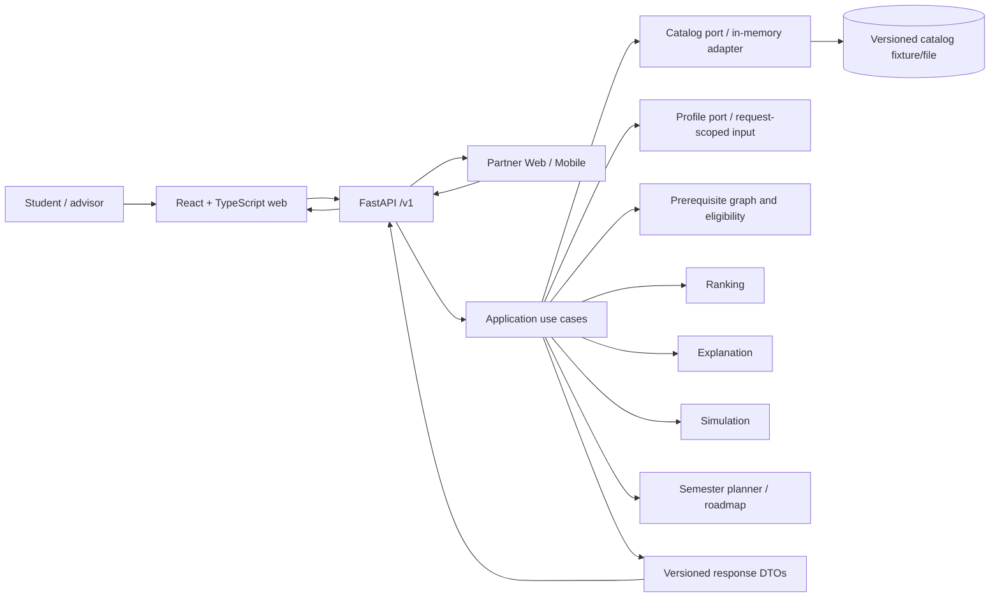
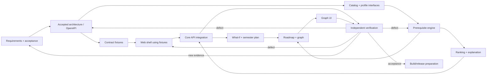

# Architecture — AI-07 Explainable Course Recommender

**Status:** Draft for human review; architecture contract `0.1.0-proposed` (not adopted). **Date:** 2026-10-04. **Project:** SE2026-T24 / SE.2026.14.

## Preflight and scope

Input: `docs/tasks/prompts/01-architecture.md` plus `common-context.md` v2, `agent-execution-review-protocol.md` v1.0, `assignment-template.md`, `fixtures/reference-scenarios.json` v2 proposed, repository README, brainstorm, pipeline, prototype, architecture README and RELATED_WORK.md. Branch: `truongan_22001535`; existing user edit to RELATED_WORK.md was preserved. No application implementation or tests were changed. Exact accepted contract version: none. Design outputs below define only a proposal.

Current implementation is a single browser prototype (`src/prototype/index.html`) with hard-coded demo catalog, profile and ranking, local plan state and simulated normal/degraded/unavailable modes. It offers illustrative score/reason behavior; there is no backend/web application framework, persisted profile, canonical API, dependency manifest or application contract. Folder READMEs/pipeline describe intent, not implemented services. Existing score arithmetic and policy do not establish approved rules.

## Product and architecture

AI-07 is a decision-support tool. A student reviews and chooses courses; the system never enrolls the student or certifies graduation. Core path: editable synthetic profile and career/interest goals → mandatory prerequisite eligibility → explainable deterministic ranking → why/why-not → simulated alternatives → credit-constrained term plan and bounded roadmap. Web and partner clients consume the same versioned API. Course selection is distinct from section scheduling and completion.

Use a **Python 3.12+ / FastAPI modular monolith**, with a typed React + TypeScript web client. Backend modules: HTTP/validation, application use cases, domain models/policies, catalog/profile ports and in-memory adapters, prerequisite graph, ranking, explanations, simulation, semester planning, roadmap, and serializers. The in-memory catalog/profile adapter is the initial source; no database is specified because persistence requirements and deployment topology are unknown. Profile and plan are request-scoped in v0.1; browser may hold an editable draft locally, but server promises no cross-session retention. Domain services are plain Python and callable without ASGI. React consumes API fixtures first; an adapter switch supports later live integration. No LLM, embeddings, RAG, Redis, microservices or product agents: academic logic is structured and deterministic. Optional language paraphrase can be considered only with grounded evidence, validation, timeout, fallback and an evaluation need; it cannot affect rules or scores.

### System context and modules

### Module → folder map (required repository structure)

No root `backend/`, `frontend/`, `tests/` or `deployment/` directories.

| Module | Folder | Tests |
|---|---|---|
| FastAPI app entrypoint, routers, DTO serializers | `src/backend/app.py`, `src/backend/routers/` | `test/contract/`, `test/integration/` |
| Domain: catalog, profile, prerequisites, ranking, explanations, simulation (+ stretch planner/roadmap) | `src/backend/domain/` | `test/backend/` |
| Catalog/profile adapters, bundled snapshot | `src/backend/data/` | `test/backend/` |
| React + TypeScript web client | `src/web/` | `test/web/` |
| Browser prototype (reference only, do not extend) | `src/prototype/` | — |
| Synthetic data generator, fairness report, ML baseline for ADR-001 | `tools/` | `test/backend/test_synthetic_data.py`, `test/backend/test_fairness.py` |
| Build, container, release | `build/deploy/` | — |
| Architecture, OpenAPI, ADRs, fairness design | `docs/architecture/` (`contracts/`, `adr/`) | contract checks |
| Backlog, pipeline, evidence | `docs/tasks/` (`evidence/`) | — |

## API and data contract

Canonical proposal: `contracts/openapi.yaml`, OpenAPI 3.1, API `/v1`, schemas named in English, `course_id` is a stable catalog identifier (case-sensitive ASCII `[A-Z0-9_-]+`), credit unit is integer credits, workload is estimated `hours_per_week`, grades are numeric points on proposed `0..10` scale. All IDs use UTF-8 strings; timestamps RFC 3339 UTC. Request ID is echoed/generated. `contract_version`, `catalog_version`, `algorithm_version`, and `scenario_id` identify provenance. No hidden conversion from course to section.

Resources: `GET /catalog/courses` (filter/paginate), `GET /catalog/graph`; `POST /profiles/validate` (stateless validation only); `POST /recommendations`; `POST /why-not`; `POST /simulations`; `POST /semester-plans`; `POST /roadmaps`. Request bodies carry their profile and catalog selection so these operations are reproducible and stateless. This avoids premature profile CRUD/persistence. The validate resource checks input shape and references; it does not save a profile. Unnecessary enrollment, degree audit, authentication, and CRUD resources are out of scope.

Common errors: 400 malformed JSON, 404 unknown resource, 409 stale/unsupported catalog version or invalid graph state, 422 field/policy validation, 503 catalog unavailable. Valid requests with no eligible courses return 200 with `status: empty` and reasons, not 404. Domain ranking/explanation partial failure returns 200 only if eligibility and all returned values are verifiable; `status: degraded`, omitted failed fields and warnings. Otherwise 503 `SERVICE_UNAVAILABLE`. Include `{request_id, contract_version, error:{code,message,retryable,details?}}`. Never return fabricated personalized rank on catalog outage.

Every domain interface:

| Producer → consumer | Input/output | Error behavior |
|---|---|---|
| Catalog adapter → use cases | `CatalogSnapshot` with version, courses and declared offerings | `CatalogUnavailable`; never use an unversioned fallback |
| Profile validator → all use cases | normalized `StudentProfile` / field errors | reject unknown course IDs, invalid units and conflicting states |
| Prerequisite engine → rank/planner/explanation | eligibility, direct missing IDs, paths, graph version | invalid refs/cycle => catalog invalid; no eligibility result |
| Ranker → explanation/simulation/planner/API | deterministic `RankedCourse` components, total, tie key | invalid weights/input => validation error; internal failure does not fabricate rank |
| Explanation service → API | reason codes with component/evidence references | evidence mismatch => omit affected explanation, degraded warning |
| Simulation service → API | immutable baseline and scenario deltas | invalid scenario => 422; baseline unchanged |
| Planner → API | selected entries and `complete/partial/infeasible` status | unmet constraints listed; never silently drop selected items |
| Serializer/API → clients | schema-versioned DTO | request ID on all responses; safe 5xx on unexpected faults |

Examples in `contracts/examples/` include valid and invalid request shapes per body-bearing proposed operation plus success, empty, blocked, invalid, comparison, plan and failure outcomes. They are proposed fixtures, not evidence of runtime responses.

## Domain semantics (all policies below PROPOSED until adopted)

History states: `passed` with grade, `failed` with grade, `planned` (selected intent, no eligibility effect), and `hypothetical_passed` (scenario-only, no baseline mutation). A course cannot simultaneously occupy multiple baseline states. Grade scale and pass threshold are unresolved: fixtures propose 0–10 and >=5. Missing grade cannot establish pass; record `completion_status` separately only after a human adopts a policy. No retroactive invalidation of a recorded pass because an ancestor is absent. Completed courses are excluded from recommendable-now, but remain queryable by why-not. Failed courses do not satisfy prerequisites. Planned courses never satisfy eligibility within the same semester.

Mandatory prerequisites are hard AND gates initially; recommended preparation is a separate soft catalog signal and can influence `preparation` component only. Edges point prerequisite → dependent. Reject missing references and cycles. Eligibility requires every mandatory prerequisite to be passed before the proposed semester. Explanation distinguishes missing direct prerequisites from transitive paths; conditional unlock is shown only if all remaining ancestors/conditions can be satisfied under the stated hypothetical sequence. If all direct prerequisites are passed and other validation succeeds, the course is immediately eligible for a later decision. Rank, eligibility and credit-plan inclusion are separate states.

Fixture oracle checks: BASE eligible-now `{ST201, SE201}`; AI301 missing direct ST201; DL401 missing AI301. FAILED cannot take ST201 because failed MA101 is not passed. READY can take AI301 but not DL401 because AI301 is not passed. Selection of ST201 does not make AI301 eligible in the same term. These confirm internal fixture logic only, not university policy.

## Reliability and quality

Catalog is loaded as an immutable, versioned snapshot and validated at startup/request boundary. Invalid graph => no personalized results (503/409 per source). A bundled snapshot may be a fallback only if it has a known version and eligibility can be fully validated; label `degraded`, data age and source. Ranking error: retain eligibility/why-not if independently valid, omit ranking and mark degraded; if contract requires rank then respond 503. Explanation failure: return score only with an explicit warning, never synthesize reason. Empty eligible set is normal `empty`. Invalid scenario => 422, no partial mutation. Infeasible roadmap returns `infeasible` or `partial` with unmet constraints and unscheduled course IDs. Stale catalog version => conflict and ask client to refresh.

Proposed quality scenarios (targets are proposals, not measurements):

| Source | Stimulus / environment | Response | Proposed target | Verification |
|---|---|---|---|---|
| API client | valid recommendation, local service, synthetic fixture | stable, versioned response | p95 < 500 ms at 50 concurrent requests | load test when deployment exists |
| Catalog owner | cycle or dangling prerequisite in snapshot | reject snapshot, no eligibility claims | detection 100% on injected invalid refs/cycles | graph boundary tests |
| Student | baseline then priority what-if | same baseline digest; separate scenario ID/deltas | baseline unchanged in every case | deep-copy/immutability assertions |
| Student | selected workload exceeds credits | partial/infeasible with exact IDs and totals | never return over-limit complete plan | boundary tests |
| Partner | catalog unavailable | 503, request ID, retryable, no personalized fallback | 100% injected outages safe | fault-injection contract tests |
| Student | no eligible courses | empty response with why-not access | complete, non-error response | fixture contract test |
| Student | explanation evidence mismatch | omit claim, degraded warning | zero unsupported reasons | evidence-reference assertions |

Required checks (not run in this design task): eligibility and BASE/FAILED/READY; score contribution sum; deterministic tie order; baseline immutability; prerequisite ordering and offerings; plan credit cap; evidence referential integrity; OpenAPI/example schema validation; producer-consumer integration. Human usability target in brainstorm (5–8 users, >=80% correctly restate reason) remains proposed and unmeasured. RE-094 771 concurrent users / 38-day retention / 10-hour CR is excluded pending explicit adoption.

## Development dependency and integration plan

Parallelism is conditional: web may build against accepted fixtures while backend is incomplete (`MOCK_DEPENDENCY`), but live integration remains pending. One assigned writer each for canonical domain models, application entrypoint, each shared router group, dependency manifest and OpenAPI/examples. No teammate names are assigned by this document. Ownership must be filled in the dispatch task before implementation. Integrate core slices incrementally; return defects to owning module and rerun affected consumer checks.

## Gate checklist — no overall GO

| Gate item | State | Evidence / missing input |
|---|---|---|
| Repository inspected; prototype confirmed mock-only | PASS | Preflight above; `src/prototype/index.html` inspected |
| RELATED_WORK evidence limitations respected | PASS | Vendor/research claims treated as context, not mandates |
| Stack and module boundaries documented | PASS | Draft modular monolith below |
| Schema, examples and source contracts accepted by humans | NEEDS_INPUT | No accepted contract/version supplied |
| Passing threshold, grade/missing-grade and repeat policy | NEEDS_INPUT | University policy unavailable; 5/10 is fixture proposal |
| Workload and career-goal component extraction adopted | NEEDS_INPUT | Component oracle does not define goal-to-component mapping |
| Offerings/term calendar and roadmap horizon adopted | NEEDS_INPUT | All-term offerings only illustrative fixture assumption |
| Persistence/retention/deployment needs confirmed | NEEDS_INPUT | Stateless v0.1 design proposal only |
| OpenAPI YAML parser and schema validator available | PASS | Python `yaml` and `jsonschema` importable; `openapi-spec-validator` package unavailable |
| Contract/example checks | PASS | 12 body-request schema cases, 4 query cases, 9 response fixtures and 54 internal refs checked; see handoff |
| Backend/frontend runtime, manifests and app code | UNVERIFIED | Not present; not in this task scope |
| Independent review / human acceptance | UNVERIFIED | Pending; architecture author cannot self-approve |

**Current task status:** PARTIAL because material policy choices and independent acceptance remain pending; draft contract/example checks completed. Product gate remains NEEDS_INPUT for academic semantics. **Review:** INDEPENDENT_REVIEW_PENDING. **Integration:** MOCK_ONLY / not applicable yet. See `docs/tasks/ARCHITECTURE_HANDOFF.md` for decision queue, ownership map and next-agent gate.
